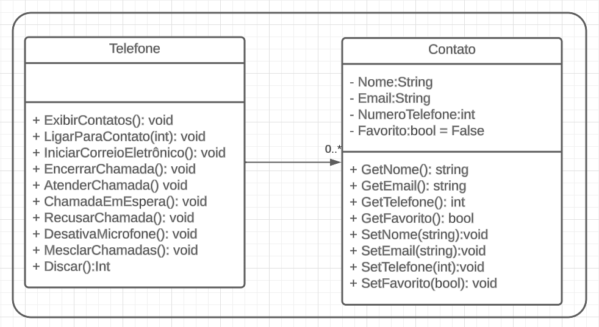
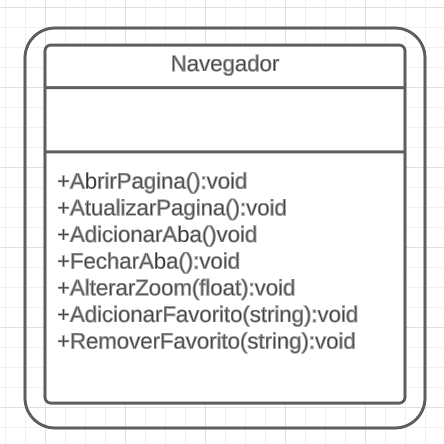

# Orientação a Objetos e UML: Diagramação de Classes do iPhone

Abstração de algumas funções de acordo com o vídeo de lançamento do Iphone 2007.

## Diagrama UML de Classe para as funções de Ipod

## Diagrama UML de Classe para as funções de Telefone

## Diagrama UML de Classe para o navegador.

